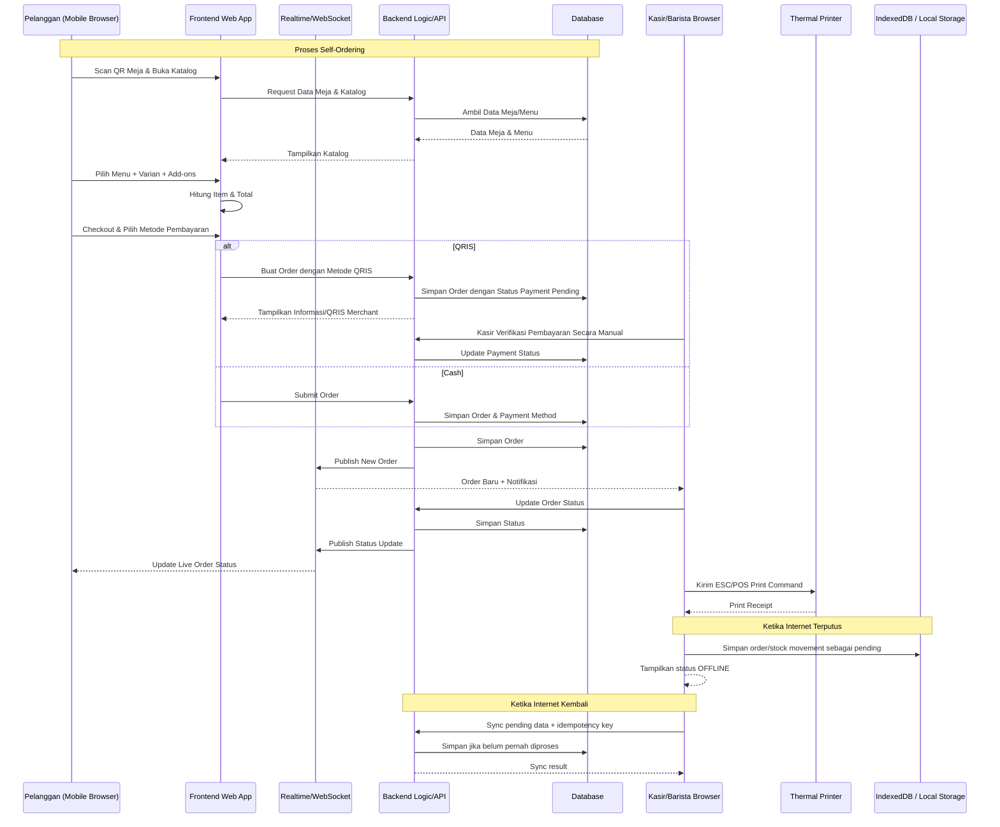
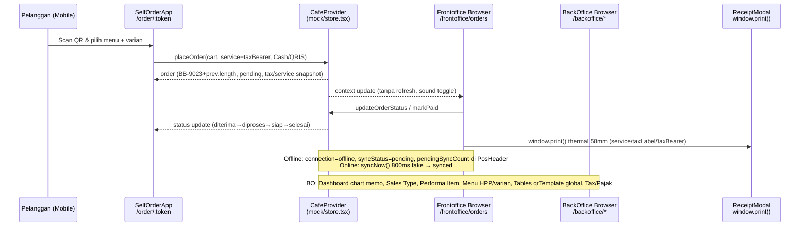
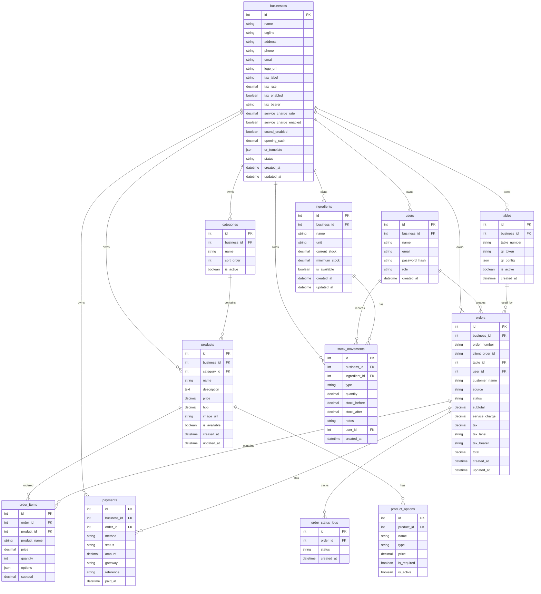

# PRD — Project Requirements Document

## 1. Overview

Aplikasi ini bertujuan untuk mendigitalkan dan menyederhanakan proses pemesanan coffee shop, mulai dari pelanggan melakukan self-order melalui QR Code di meja, pesanan masuk secara real-time ke kasir/barista, proses pembayaran, hingga pengelolaan menu, meja, stok, dan analitik oleh owner.

Sistem dirancang sebagai **Web App** dengan tiga area utama, yaitu **Halaman Pemesanan Pelanggan (Self-Ordering App)**, **Halaman Frontoffice (Kasir / Barista)** — sebelumnya disebut Point Of Sale (POS), dan **Halaman BackOffice (Owner — Analytics & Management)**. Fokus utama sistem adalah mempercepat proses pemesanan, mengurangi kesalahan input manual, menyediakan status pesanan secara real-time, dan memberikan owner data penjualan yang mudah dipantau.

> **Catatan As-Built 2026-09-04 (Fase 1 — Frontoffice/Backoffice Mock):** Landing page dihapus, `"/"` kini `RootRedirect` ke `/login` atau role-based (`owner→/backoffice/dashboard`, `kasir/barista→/frontoffice/orders`) di `frontend/src/App.tsx:27`. Auth email+password auto-detect role tanpa dropdown (`LoginPage.tsx:9`, `store.tsx:52`). `Business` diperkaya `logoUrl, taxEnabled/taxLabel/taxRate/taxBearer, serviceChargeEnabled/Rate, soundEnabled, openingCash, qrTemplate` (`shared/types/index.ts:11`, `mock/data.ts:47`). `Order` simpan `serviceCharge/tax/taxLabel/taxBearer` dengan rumus `service=subtotal*rate, taxBase=subtotal+service, tax=taxBase*rate (jika taxEnabled), total= subtotal+service + (bearer===cafe?0:tax)` (`store.tsx:109`). Route lama `/pos/*` → `/frontoffice/*` dan `/owner/*` → `/backoffice/*` via alias legacy. Schema 12 tabel PRD dipertahankan, field baru didokumentasikan di §6.

## 2. Requirements

Berikut adalah persyaratan tingkat tinggi untuk pengembangan sistem:

- **Aksesibilitas:** Aplikasi harus dapat diakses melalui Web Browser. Halaman pelanggan diutamakan responsif dan nyaman digunakan melalui smartphone, sedangkan halaman kasir/barista dan owner diutamakan nyaman digunakan melalui desktop/laptop.
- **Pengguna:** Sistem memiliki tiga area penggunaan utama:
  - **Pelanggan:** melakukan pemesanan melalui QR Code meja.
  - **Kasir / Barista:** menerima, memproses, dan mengelola pesanan.
  - **Owner:** mengelola menu, harga, meja, stok/menu availability, dan melihat analitik penjualan.
- **Self-Ordering:** Pelanggan dapat membuka katalog berdasarkan QR Code meja, memilih menu beserta varian/add-ons, memasukkan nama pada pesanan, dan melakukan checkout.
- **Pembayaran:** Sistem untuk MVP hanya mendukung dua metode pembayaran: **Cash** dan **QRIS**. QRIS untuk tahap saat ini **tidak diintegrasikan dengan Midtrans/Xendit atau payment gateway online**. *(Fase 0: Implemented — `frontend/src/features/self-order/screens/CartScreen.tsx` dan `frontend/src/features/pos/pages/ManualOrderPage.tsx` hanya menampilkan Cash & QRIS; type `transfer|debit` di `shared/types` di-reserve untuk Fase 1)*
- **Real-time Update:** Pesanan harus dapat diteruskan dari pelanggan ke kasir/barista secara real-time tanpa perlu refresh halaman. Status pesanan pelanggan juga harus diperbarui secara real-time menggunakan WebSocket atau teknologi realtime sejenis. *(Fase 0: Implemented via React Context `CafeProvider` in-memory di `frontend/src/mock/store.tsx`; Deferred — WebSocket/Supabase Realtime di Fase 1)*
- **Notifikasi:** Pesanan baru pada halaman Frontoffice harus dapat menampilkan notifikasi suara. *(Fase 1: Implemented — toggle `soundEnabled` di Frontoffice → Perangkat `PosSettingsPage.tsx:77` ↔ `Business.soundEnabled` `shared/types/index.ts:25`, `mock/data.ts:59`; order feed tetap via context)*
- **Printer:** Sistem harus mendukung pencetakan struk melalui Web Bluetooth API dan/atau direct thermal printer USB/LAN menggunakan perintah ESC/POS. *(Fase 1: Implemented sebagai print preview `window.print()` di `frontend/src/features/pos/components/ReceiptModal.tsx` + `#printable-qr-card` di `TablesPage.tsx` dengan global `qrTemplate` + fallback per-meja; Bluetooth/USB/LAN ESC/POS Deferred — Fase 1 Backend)*
- **Settings Frontoffice:** Frontoffice memiliki halaman pengaturan 3 kategori: **Perangkat** (toggle sound notifikasi di atas thermal printer `bluetooth|usb|lan`), **Modal Kas** (opening cash `Business.openingCash` `types:26`, input `openingCashInput` + info `cashPaidTotal` `PosSettingsPage.tsx:53`), dan **Akun & Sesi** (profil + logout). *(Fase 1: Implemented — `PosSettingsPage.tsx:6` `SettingCategory='device'|'cash'|'account'`, `PosHeader.tsx` Frontoffice label + logo)*
- **Settings BackOffice:** BackOffice memiliki halaman pengaturan terpisah via sidebar `OwnerSidebar.tsx:47` — **Profile Akun** (`ProfileSettingsPage.tsx:5` read-only + ubah password `isStrongPassword`), **Profile Bisnis** (`CafeSettingsPage.tsx:5` identitas + `logoUrl` 2MB `FileReader`), **Pajak & Biaya** (`TaxSettingsPage.tsx:5` toggle `taxEnabled`, radio `taxBearer customer|cafe`, select `taxLabel PB1|PBJT|PPN`, rate, service charge toggle). Route `/backoffice/settings/*` (`App.tsx:91`) dengan alias `cafe→business` dipertahankan. *(Fase 1: Implemented — inner `OwnerSettingsPage.tsx:4` kini pure `<Outlet/>`, navigasi di sidebar)*
- **Auth:** Login tanpa dropdown role — email+password auto-detect role dari `staff` array, redirect role-based (`owner→/backoffice/dashboard`, lain→`/frontoffice/orders`) + `resolveNext` hormati `?next` (`LoginPage.tsx:17`). Password min 6 huruf+angka+simbol (`StaffPage.tsx:22`, `ProfileSettingsPage.tsx:5`), seed `Owner123!|Kasir123!|Barista123!` (`mock/data.ts:62`). *(Fase 1: Implemented — mock plain, hash di Fase 1 Backend)*
- **UI Design Reference:** Desain UI utama mengacu pada referensi desain Figma yang telah dikonversi ke HTML. File HTML tersebut digunakan sebagai referensi visual dan struktur antarmuka utama, tetapi implementasi tetap harus mengikuti kebutuhan fungsional dalam PRD. *(Fase 1: Implemented dengan Tailwind 4, font `Fraunces` + `Inter` di `frontend/src/index.css` dan `material-symbols`)*
- **Manajemen Availability:** Menu/bahan yang tidak tersedia dapat diubah menjadi **Out of Stock** sehingga tidak dapat dipesan pelanggan.
- **Manajemen Meja:** Owner dapat mengatur jumlah meja dan QR Code untuk setiap meja. *(Fase 1: Implemented + area `Indoor|Outdoor|Lantai Atas` + QR preview/print + **Edit Struk Global** header `TablesPage.tsx:189` simpan `Business.qrTemplate` `types:27`, merge `globalCfg ?? t.qrConfig` untuk estetika keseluruhan)*
- **Analytics:** Owner dapat melihat ringkasan omset dan performa item berdasarkan periode harian, mingguan, dan bulanan. *(Fase 1: Implemented — Dashboard `DashboardPage.tsx:20` `useMemo` `paidOrders` per period + fallback `FALLBACK_DAYS`; Sales `SalesOmsetPage.tsx:5` bar `Omset | Sales Type (self_order vs pos)` + Sales `SalesPerformancePage.tsx:5` rename `Performa Menu→Performa Item` + tabs `menu|kategori|varian`)*
- **Offline Frontoffice:** Halaman Frontoffice harus tetap dapat digunakan untuk operasi inti ketika internet terputus, dengan penyimpanan lokal berbasis IndexedDB dan antrean sinkronisasi. *(Fase 1: Simulated — flag `connection: online|offline|syncing` + `pendingSyncCount` + `syncNow()` 800ms di `frontend/src/mock/store.tsx`; IndexedDB/Service Worker Deferred — Fase 1 Backend)*
- **Offline Sync:** Data transaksi dan perubahan stok yang dibuat saat offline harus disinkronkan otomatis ketika koneksi kembali tersedia, dengan mekanisme idempotency untuk mencegah duplikasi. *(Fase 1: `client_order_id` + `syncStatus: pending|synced` + idempotent `placeOrder` via functional update; retry/queue Deferred — Fase 1 Backend)*
- **Payment Safety:** Pembayaran QRIS tidak boleh dianggap berhasil secara otomatis ketika perangkat offline; pembayaran Cash tetap dapat dicatat secara offline. *(Fase 1: Implemented — `paymentStatus` tetap `pending` untuk QRIS saat offline)*
- **SaaS-Friendly Foundation:** MVP bukan SaaS dan tidak memiliki subscription/billing, tetapi struktur data harus memiliki batas kepemilikan bisnis (`business_id`) agar di masa depan dapat dimigrasikan ke arsitektur multi-tenant tanpa membangun ulang modul Self-Order, Frontoffice, dan Analytics. *(Fase 1: Schema PRD tetap pakai `business_id`; implementasi mock baru 1 bisnis `biz-1` di `frontend/src/mock/data.ts:47`, belum ada field `business_id` per entity — akan ditambah di Fase 1 Backend)*

## 3. Core Features

Fitur-fitur kunci yang harus ada dalam versi pertama (MVP):

1. **Halaman Pemesanan Pelanggan (Self-Ordering App)**

   - **Scan QR di Meja**
     - Pelanggan mengakses halaman pemesanan melalui QR Code yang terkait dengan nomor meja.
     - QR Code meja dibuat dan dikelola melalui halaman Owner / Manajemen Meja.
     - Sistem otomatis mengetahui nomor meja berdasarkan QR Code yang dipindai.
   - **Katalog Digital Interaktif**
     - Menampilkan daftar menu coffee shop.
     - Menu dikelompokkan berdasarkan kategori.
     - Menampilkan nama menu, harga, deskripsi, dan status ketersediaan.
     - Menu dengan status Out of Stock tidak dapat ditambahkan ke keranjang.
   - **Form Pesanan**
     - Menampilkan nomor meja yang berasal dari QR Code.
     - Pelanggan dapat memasukkan nama pada pesanan.
   - **Detail Menu, Varian, dan Add-ons**
     - Saat pelanggan memilih menu dan menekan tombol tambah, sistem menampilkan pilihan varian/add-ons jika tersedia.
     - Pilihan dapat mencakup:
       - Suhu minuman.
       - Tingkat gula.
       - Tingkat es.
       - Pilihan susu.
       - Extra espresso.
     - Sistem menghitung harga berdasarkan varian atau add-on yang dipilih.
   - **Keranjang**
     - Menampilkan seluruh item yang akan dipesan.
     - Menampilkan detail varian dan add-ons setiap item.
     - Pelanggan dapat mengubah jumlah item.
     - Pelanggan dapat menghapus item.
     - Sistem menghitung subtotal dan total pesanan.
     - **Checkout**
      - Menampilkan ringkasan pesanan.
      - Menampilkan nomor meja dan nama pada pesanan.
      - Menampilkan total pembayaran `subtotal + serviceCharge + tax` dengan rumus `service = subtotal * serviceChargeRate (jika enabled)`, `taxBase = subtotal + service`, `tax = taxBase * taxRate (jika taxEnabled)`, `total = subtotal+service + (taxBearer===cafe?0:tax)` (`shared/types/index.ts:11`, `mock/store.tsx:109`, `CartScreen.tsx:40`, `ManualOrderPage.tsx:54`). Contoh `"Biaya sudah termasuk pajak"` ditampilkan, rincian `Service %` & `Pajak PB1%` tetap tampil di preview sebelum dibatalkan terakhir — sekarang tetap tampil per revisi terbaru.
      - Pilihan metode pembayaran (Fase 1: hanya dua):
        - **QRIS** menggunakan QRIS statis/QRIS merchant tanpa auto-verification dari payment gateway (pending, verifikasi manual kasir).
        - **Cash** (pending, bayar di kasir).
      - Jika pelanggan memilih **Cash**, sistem menampilkan notifikasi bahwa pelanggan harus segera melakukan pembayaran di kasir.
      - Sistem menyimpan pesanan dan status pembayarannya (`paymentStatus: pending|paid`, `taxLabel/taxBearer, serviceCharge, syncStatus: pending|synced`).
    - **Live Order Status**
      - Pelanggan dapat melihat perkembangan pesanan secara real-time.
      - Status utama (Fase 1: 4 langkah di `frontend/src/features/self-order/screens/StatusScreen.tsx`):
        - **Diterima**
        - **Diproses**
        - **Siap Diambil/Disajikan**
        - **Selesai**
      - Perubahan status dikirim menggunakan WebSocket/Realtime update tanpa perlu refresh halaman. *(Fase 1: via `CafeProvider` context + `updateOrderStatus` di `store.tsx`; WebSocket Deferred — Fase 1 Backend)*

2. **Halaman Frontoffice (Kasir / Barista)** — sebelumnya disebut Point Of Sale (POS)

    - **Real-time Order Feed** *(Fase 1: Implemented — `frontend/src/features/pos/pages/OrdersPage.tsx` + `mock/store.tsx` context, route `/frontoffice/orders` di `App.tsx:44`)*
      - Pesanan dari pelanggan masuk ke halaman Frontoffice secara real-time.
      - Tidak membutuhkan refresh halaman.
      - Pesanan baru memicu notifikasi suara via toggle `Business.soundEnabled` (`PosSettingsPage.tsx:77` — Perangkat) *(Fase 1: Implemented — soundEnabled true/false, pemutaran audio deferred jika disabled)*.
      - Menampilkan informasi penting seperti nomor order, nomor meja, nama pelanggan, item, varian, add-ons, metode pembayaran, dan status pembayaran.
    - **Manajemen Status Pesanan**
      - Kasir/barista dapat mengubah status pesanan:
        - Diterima.
        - Diproses.
        - Siap Diambil/Disajikan.
        - Selesai.
      - Perubahan status langsung dikirim ke halaman pelanggan secara real-time. *(Fase 1: via `updateOrderStatus` + `markPaid` di `store.tsx`)*
   - **Input Pesanan Manual**
     - Kasir dapat membuat pesanan secara manual untuk pelanggan yang memesan langsung di kasir/meja kasir.
     - Antarmuka harus cepat digunakan untuk transaksi langsung.
     - Mendukung terutama transaksi dengan pembayaran Cash.
     - Pesanan manual mengikuti alur order yang sama dengan pesanan dari self-order. Preview ticket menghitung `subtotal + service + tax` sesuai `Business` (`ManualOrderPage.tsx:53`).
   - **Pembayaran Pesanan**
     - Kasir dapat melihat metode pembayaran yang dipilih pelanggan.
     - Untuk pembayaran Cash, sistem menampilkan informasi bahwa pembayaran perlu dilakukan di kasir dan kembalian dihitung dari `total` (`ManualOrderPage.tsx:60`).
     - Status pembayaran dapat dicatat agar order dapat diproses sesuai aturan pembayaran.
    - **Cetak Struk Otomatis** *(Fase 1: print preview di `ReceiptModal.tsx` + `window.print()` dengan `serviceCharge, taxLabel, taxBearer`)*
      - Sistem mendukung pencetakan struk setelah transaksi/order sesuai kebutuhan.
      - Integrasi dapat menggunakan:
        - Web Bluetooth API. *(Deferred — Fase 1 Backend)*
        - Direct Thermal Printer melalui USB. *(Deferred)*
        - Direct Thermal Printer melalui LAN. *(Deferred)*
      - Format komunikasi printer menggunakan perintah **ESC/POS**. *(Fase 1: simulasi thermal 58mm di `ReceiptModal.tsx:86` + `#printable-qr-card` di `TablesPage.tsx` dengan `qrTemplate` global)*
      - Struk minimal berisi informasi coffee shop, nomor order, waktu, nomor meja, nama pelanggan, daftar item, varian/add-ons, `serviceCharge`, `taxLabel/taxBearer` (`ditanggung kafe` jika `cafe`), total, dan metode pembayaran.
    - **Manajemen Stok / Availability Real-time** *(Fase 1: Implemented — `frontend/src/features/pos/pages/CatalogPage.tsx` toggle + `store.tsx:toggleProductAvailability`)*
      - Kasir/barista dapat melakukan toggle cepat terhadap menu atau bahan yang tidak tersedia.
      - Menu yang ditandai **Out of Stock** langsung tidak dapat dipesan pelanggan.
      - Perubahan availability harus tersinkron secara real-time atau near real-time pada katalog pelanggan.
    - **Manajemen Bahan** *(Fase 1: Implemented — `frontend/src/features/pos/pages/InventoryPage.tsx`)*
      - Kasir/barista dapat melihat daftar bahan operasional coffee shop.
      - Menambah, mengedit, menghapus/menonaktifkan bahan. *(hapus sudah fix via `removeIngredient` di `store.tsx`)*
      - Mencatat stok masuk dan penyesuaian stok secara manual.
      - Menampilkan stok saat ini, satuan, batas minimum, Low Stock, dan Out of Stock.
      - Setiap perubahan stok dicatat dalam riwayat pergerakan stok (`stock_movements`).
    - **Offline Mode & Synchronization** *(Fase 1: Simulated — `connection` + `pendingSyncCount` + `syncNow()` di `store.tsx`)*
      - Frontoffice tetap dapat dibuka dan menjalankan operasi inti ketika koneksi internet terputus.
      - Data order manual, perubahan status yang diizinkan, dan stock movement yang dibuat saat offline disimpan pada IndexedDB/local database. *(Fase 1: in-memory `syncStatus`; IndexedDB Deferred — Fase 1 Backend)*
      - Setiap transaksi offline memiliki `client_order_id`/idempotency key unik untuk mencegah order ganda ketika sinkronisasi. *(Fase 1: `clientOrderId = uid('cli')` + functional update `placeOrder`)*
      - Sistem menampilkan indikator **Online**, **Offline**, dan **Syncing** serta jumlah data yang menunggu sinkronisasi. *(Implemented di `PosHeader.tsx:11` Frontoffice)*
      - Saat koneksi kembali, Sync Engine mengirim data pending ke backend secara otomatis dan melakukan retry untuk data yang gagal. *(Fase 1: 800ms fake sync; retry Deferred)*
      - Kegagalan printer tidak boleh menghapus atau menggagalkan data transaksi yang sudah tersimpan.
      - Self-Ordering pelanggan tidak wajib mendukung transaksi offline.
      - Pembayaran QRIS tidak dapat diverifikasi otomatis ketika offline; verifikasi dilakukan sesuai proses operasional kasir.
    - **Frontoffice Settings (Perangkat, Modal Kas, Akun)** *(Fase 1: Implemented — `PosSettingsPage.tsx:6` `device|cash|account`, header `Perangkat` + toggle sound, `Modal Kas` openingCash, `PosHeader` logo + Frontoffice label; alias legacy `/pos/*` → `/frontoffice/*` di `App.tsx:101`)*

3. **Halaman BackOffice (Owner — Analytics & Management)** — sebelumnya disebut Owner
   - **Dashboard Owner** *(Fase 1: Implemented — `DashboardPage.tsx:20` `useMemo` agregasi `paidOrders` per period `daily|weekly|monthly` + `FALLBACK_DAYS` + tooltip; toggle `period` dipertahankan)*
     - Menampilkan ringkasan performa penjualan (`revenue, totalOrders, avg`).
     - Menampilkan omset berdasarkan periode (grafik `chart` dinamis dari `paidOrders`, label `8:00 / Sen / M1`).
     - Menampilkan informasi menu terlaris (Top 5 via `Map` counts).
     - Menampilkan status menu/availability yang relevan.
   - **Laporan Penjualan** *(Fase 1: Implemented — `SalesOmsetPage.tsx:5` bar `Omset | Sales Type (self_order vs pos)` + `SalesHistoryPage`)*
     - Visualisasi omset harian, mingguan, bulanan (chart `chartData` statis per period + `salesTypeChart` stacked self/manual).
     - Visualisasi Sales Type: `Self Order` vs `Manual Order` (`source` `self_order|pos`) dengan cards `selfRevenue/manualRevenue` + proporsi.
     - Data `paidOrders` filter `paymentStatus==='paid' && year===selectedYear`; export CSV `Laporan_Omset_* | Sales_Type_*`.
   - **Menu Terlaris → Performa Item (Best Seller Tracking)** *(Fase 1: Implemented — `SalesPerformancePage.tsx:5` rename `Performa Menu→Performa Item`, tabs `menu|kategori|varian`)*
     - Menampilkan grafik/list menu terlaris & kurang laku (Top 5 / Low 5).
     - Analisis berdasarkan jumlah item yang terjual + revenue.
     - Tab `Kategori` group by `Category.name` via `prodCat Map`; tab `Varian & Addons` hitung `item.options` (`milk:Oat`, `addon:true`).
     - Export CSV per tab `Performa_Item_Menu|Kategori|Varian`.
   - **Manajemen Harga & Katalog** *(Fase 1: Implemented — `MenuCatalogPage.tsx:7` modal `max-w-lg` dengan `ALL_VARIANTS` dropdown existing, chips `Oat (+5k)`, simpan `draft.options`; field `HPP (opsional)` `Product.hpp` `shared/types:78` hanya di form)*
     - Tambah menu.
     - Edit menu (prefill `draft`).
     - Hapus menu.
     - Mengatur harga menu + **HPP opsional** (tidak wajib).
     - Mengatur kategori menu.
     - Mengatur deskripsi dan informasi menu.
     - Mengatur varian/add-ons yang tersedia pada menu (multi-select per `type`).
     - Mengatur status ketersediaan menu.
   - **Manajemen Meja** *(Fase 1: Implemented — `TablesPage.tsx:12` + `shared/types:36` `QrConfig`, global `Business.qrTemplate` `types:27`)*
     - Mengatur jumlah meja coffee shop.
     - Tambah meja (auto `padStart(2,0)`).
     - Edit meja / toggle aktif.
     - Hapus/nonaktifkan meja.
     - Mengatur nomor atau identitas meja.
     - Membuat/mengelola QR Code unik untuk setiap meja + **Edit Struk Global** header `Edit Struk` drawer 380px (`globalDraft` → `updateBusiness({qrTemplate})`) + fallback per-meja `t.qrConfig` (drawer `editingQrTable` dipertahankan) + merge `globalCfg ?? t.qrConfig` untuk `printable-qr-card`.
     - QR Code digunakan sebagai pintu masuk ke halaman self-order dengan konteks nomor meja yang sesuai.

     - **BackOffice Settings — Sidebar Vertikal** *(Fase 1: Implemented — `App.tsx:91` `settings` children `profile|business|tax + alias cafe→business`, `OwnerSettingsPage.tsx:4` pure `<Outlet/>` tanpa inner bar, navigasi di `OwnerSidebar.tsx:47` `Profile Akun (/backoffice/settings/profile) | Profile Bisnis (/backoffice/settings/business) | Pajak & Biaya (/backoffice/settings/tax)`)*
       - **Profile Akun** (`ProfileSettingsPage.tsx:5` read-only name/email/role + **Ubah Password** self-service `isStrongPassword` → `upsertStaff`).
       - **Profile Bisnis** (`CafeSettingsPage.tsx:5` identitas + `logoUrl` 2MB `FileReader` preview/ganti/hapus).
       - **Pajak & Biaya** (`TaxSettingsPage.tsx:5` toggle `taxEnabled`, radio `taxBearer customer|cafe`, select `taxLabel PB1|PBJT|PPN`, rate, service toggle/rate, `updateBusiness` clamp 0-100, contoh `50k→service→tax`).
       - **Staff** (`StaffPage.tsx:7` CRUD + password strong + toggle active + delete, `StaffUser.password` `types:30`; hapus admin ditunda).
       - Role staff (Fase 1): **Owner, Kasir, Barista** saja (`UserRole` di `shared/types/index.ts:1`) — role `manager`/`kitchen` tidak dipakai agar konsisten dengan `RequireAuth`.
       - Pengelolaan akun dan staff harus dilindungi oleh authorization berbasis role. *(Fase 1: `RequireAuth roles={["owner"]}` untuk `/backoffice`, `roles={["kasir","barista","owner"]}` untuk `/frontoffice` di `App.tsx:44,64`; alias `/pos/*`→`/frontoffice`)*

## 4. User Flow

Alur kerja utama sistem:

### A. Pelanggan — Self-Ordering

1. **Scan QR Meja:** Pelanggan melakukan scan QR Code yang tersedia di meja. *(Fase 0: `SelfOrderApp.tsx` validasi strict — token invalid/inaktif → "Meja tidak ditemukan", tanpa token fallback ke meja 04)*
2. **Masuk ke Katalog:** Sistem membuka halaman self-order dan otomatis mengenali nomor meja. *(mobile-first, `max-w-md` layout di `SelfOrderApp.tsx`)*
3. **Pilih Menu:** Pelanggan melihat katalog digital dan memilih menu yang tersedia. *(kategori pills + grid 2 kolom di `MenuScreen.tsx`)*
4. **Pilih Varian/Add-ons:** Jika menu memiliki pilihan, pelanggan memilih suhu minuman, tingkat gula, tingkat es, pilihan susu, extra espresso, atau add-ons lainnya. *(bottom-sheet `ItemSheet.tsx`, kalkulasi harga varian; `ManualOrderPage` sinkron dengan `calculateItemPrice`)*
5. **Tambah ke Keranjang:** Item beserta konfigurasi varian/add-ons masuk ke keranjang.
6. **Isi Nama:** Pelanggan memasukkan nama yang akan ditampilkan pada pesanan. *(validasi wajib di `CartScreen.tsx`)*
7. **Checkout:** Pelanggan memeriksa ringkasan pesanan dan memilih metode pembayaran **Cash atau QRIS** saja.
8. **Pembayaran:**
   - Jika **QRIS**, pelanggan menggunakan QRIS merchant yang disediakan. Untuk MVP, verifikasi pembayaran dilakukan secara manual oleh kasir dan tidak menggunakan Midtrans/Xendit.
   - Jika **Cash**, sistem memberi notifikasi untuk segera membayar di kasir.
9. **Order Diterima:** Pesanan masuk ke sistem kasir/barista secara real-time via `CafeProvider` (Fase 0) — target WebSocket di Fase 1.
10. **Tracking:** Pelanggan melihat status pesanan (4 langkah di `StatusScreen.tsx`):
    - Diterima.
    - Diproses.
    - Siap Diambil/Disajikan.
    - Selesai.
11. **Selesai:** Pelanggan mengambil atau menerima pesanan ketika status sudah Siap/Selesai.

### B. Frontoffice (Kasir / Barista) — sebelumnya POS

1. **Login:** Hapus dropdown role — email+password auto-detect `staff` (`LoginPage.tsx:9`, `store.tsx:52` `login(email,password)=>StaffUser|null`), redirect `owner→/backoffice/dashboard`, lain→`/frontoffice/orders` (`App.tsx:27` `RootRedirect`). *(Fase 1: Implemented — mock plain, toggle show/hide)*
2. **Monitoring:** Frontoffice membuka halaman order feed (`/frontoffice/orders` di `OrdersPage.tsx`, filter `diterima|diproses|siap|selesai`; `RootRedirect` handle `/pos/*` alias).
3. **Order Baru:** Pesanan pelanggan muncul via context + **toggle sound** di `Perangkat` (`Business.soundEnabled`); jika dimatikan tidak bunyi.
4. **Verifikasi Pembayaran:** Kasir memeriksa status/metode pembayaran (`paymentStatus: pending|paid`, `taxLabel/taxBearer` tampil di ticket jika `cafe`).
5. **Terima Pesanan:** Order ditandai sebagai Diterima.
6. **Proses Pesanan:** Barista mengubah status menjadi Diproses (`updateOrderStatus`).
7. **Siapkan Pesanan:** Barista membuat minuman/makanan berdasarkan item, varian, dan add-ons.
8. **Cetak Struk:** Sistem dapat mencetak struk melalui `ReceiptModal.tsx` (`window.print()` thermal 58mm `serviceCharge, taxLabel/taxBearer`→ `TOTAL (tanpa pajak)` jika `cafe`; ESC/POS Bluetooth/USB/LAN Deferred — Fase 1 Backend).
9. **Pesanan Siap:** Status diubah menjadi Siap/Selesai dan pelanggan mendapatkan update via context.
10. **Input Manual:** Untuk pelanggan yang memesan langsung, kasir membuat order melalui `/frontoffice/manual` (`ManualOrderPage.tsx:53` preview `subtotal+service+tax` dengan `taxBearer` branch) dan mengikuti alur order yang sama.
11. **Offline Handling:** Jika koneksi `offline`, order manual dan stock movement disimpan dengan `syncStatus: pending` + `clientOrderId`, `PosHeader` (`Frontoffice`) tampil `cloud_off` + `pendingSyncCount`; `syncNow()` sinkron saat online kembali.
12. **Manajemen Bahan:** Frontoffice memeriksa stok bahan di `/frontoffice/inventory` (`InventoryPage.tsx`), mencatat stok masuk/penyesuaian, dan melihat Low Stock/Out of Stock.
13. **Frontoffice Settings:** Kasir membuka `/frontoffice/settings` (`PosSettingsPage.tsx:6`) — **Perangkat** (sound toggle + thermal `bluetooth|usb|lan` + IP `192.168.1.200`), **Modal Kas** (`openingCash` input + `cashPaidTotal` info, simpan `updateBusiness`, tanpa `expectedCash`), **Akun & Sesi** (profil + logout).

### C. BackOffice (Owner)

1. **Login/Akses Owner:** Owner membuka `/backoffice` via `RootRedirect` + `RequireAuth` owner.
2. **Monitoring Penjualan:** Owner melihat dashboard dan laporan penjualan (`/backoffice/dashboard` `DashboardPage.tsx:20`, `sales/omset` `SalesOmsetPage.tsx:5` dengan `Omset | Sales Type`, `sales/performa` `Performa Item`).
3. **Analisis Menu:** Owner melihat menu terlaris dan performa item (`Performa Item` tabs `menu|kategori|varian`).
4. **Kelola Katalog:** Owner menambah, mengedit, atau menghapus menu dan mengatur harga/HPP/kategori/varian (`/backoffice/menu/catalog` `MenuCatalogPage.tsx:7` `hpp` opsional + dropdown `ALL_VARIANTS`).
5. **Kelola Varian:** Owner mengatur varian dan add-ons yang tersedia untuk menu (`/backoffice/menu/variants`).
6. **Kelola Meja:** Owner mengatur jumlah meja dan QR Code (`/backoffice/tables` `TablesPage.tsx:12` + global `Edit Struk` vs per-meja fallback).
7. **Monitoring Availability:** Owner dapat memastikan menu yang tidak tersedia ditandai Out of Stock.
8. **BackOffice Settings:** Owner mengatur profil bisnis (`/backoffice/settings/business` `CafeSettingsPage` identitas+logo), pajak & biaya (`/backoffice/settings/tax` `TaxSettingsPage` toggle `taxEnabled` + radio `taxBearer` + `taxLabel/Rate` + service), profile akun (`/backoffice/settings/profile` ubah password), dan mengelola staff (`/backoffice/staff`) serta role aksesnya.

## 5. Architecture

Berikut adalah gambaran arsitektur sistem dan aliran data secara teknis namun sederhana:



#### Arsitektur As-Built Fase 1 (Mock Frontend-Only — Frontoffice/Backoffice)



> **Catatan:** Diagram di atas adalah **As-Built Fase 1**. Diagram sebelumnya tetap sebagai **Target Ideal (Fase 2)** dengan Server/DB/Realtime/IndexedDB.

Arsitektur sistem secara umum terdiri dari:

- **Frontend Web App (Fase 1: Implemented):** antarmuka pelanggan, Frontoffice, dan BackOffice di `frontend/src/` (React 19 + Vite + Tailwind 4, `BrowserRouter basename=/POS-cafe/` `App.tsx:37`, alias `pos→frontoffice, owner→backoffice` `App.tsx:101`).
- **Backend/API:** menangani autentikasi, katalog, order, pembayaran, status order, manajemen meja, laporan, dan validasi data. *(Deferred — Fase 1 Backend)*
- **Database:** menyimpan data menu, kategori, varian, add-ons, meja, order, detail order, pembayaran, user, bahan, stok, pergerakan stok, dan data penjualan. *(Fase 1: mock di `frontend/src/mock/data.ts` & types di `shared/types`; DB Postgres Deferred — Fase 1 Backend, schema PRD tetap dengan `business_id`)*
- **Realtime Layer:** WebSocket atau layanan realtime untuk sinkronisasi order dan status tanpa refresh. *(Fase 1: React Context + `soundEnabled` toggle; Deferred — WebSocket/Supabase Realtime Backend)*
- **Payment:** MVP mendukung **Cash dan QRIS saja**. QRIS saat ini tidak menggunakan Midtrans/Xendit atau payment gateway; verifikasi pembayaran dilakukan manual oleh kasir. *(Implemented: `paymentMethod: qris|cash`, `paymentStatus: pending|paid`; `taxBearer` & `serviceCharge` masuk ke `total` sesuai `store.tsx:113`)*
- **Printer Integration:** Web Bluetooth API dan/atau printer USB/LAN dengan ESC/POS; konfigurasi perangkat dikelola melalui Frontoffice → Perangkat. *(Fase 1: `window.print()` + `#printable-qr-card` + global `qrTemplate` (`TablesPage.tsx:189`); ESC/POS Bluetooth/USB/LAN Deferred)*
- **Responsive Client:** halaman self-order dioptimalkan untuk smartphone (`max-w-md`, `min-h-screen`), sementara Frontoffice dan BackOffice dioptimalkan untuk desktop/laptop.

## 6. Database Schema

Untuk versi MVP, struktur database tetap dibuat sederhana, tetapi **Manajemen Bahan** dan **Offline** menjadi bagian wajib. Database menggunakan **12 tabel inti** dengan `business_id` di tiap tabel operasional agar **SaaS-ready** (pertahankan sesuai permintaan user). Tabel `businesses` hanya menjadi boundary kepemilikan data agar sistem **SaaS-friendly** di masa depan; MVP tetap hanya digunakan untuk satu bisnis dan tidak memiliki fitur subscription/billing/multi-tenant. **PRD ini mempertahankan `business_id` untuk semua tabel meski Fase 0 belum menggunakannya per-entity.**

Data operasional utama menggunakan `business_id` agar seluruh menu, meja, order, pembayaran, bahan, dan analytics jelas dimiliki oleh satu bisnis. Saat ini cukup terdapat satu record bisnis aktif (`biz-1` Bean & Brew di `frontend/src/mock/data.ts:47`). Jika di masa depan sistem berubah menjadi SaaS, konsep ini dapat dikembangkan menjadi tenant/multi-tenant tanpa mengubah domain Self-Order, POS, dan Analytics secara fundamental.

> **Implementasi Fase 1 (As-Built):** Belum ada DB server. Data dipegang di `frontend/src/mock/store.tsx` (`CafeProvider` dengan `business|staff|categories|products|tables|orders|ingredients|movements|session|connection` + `openingCash, soundEnabled, qrTemplate`) dan `frontend/src/shared/types/index.ts` (`Business taxEnabled/taxLabel/taxRate/taxBearer/serviceChargeEnabled/Rate/soundEnabled/openingCash/qrTemplate`, `Order serviceCharge/tax/taxLabel/taxBearer`, `Product hpp`, `CafeTable qrConfig`, `QrConfig`, `TaxLabel/TaxBearer`). Field `business_id` belum ada per entity di types — akan ditambah di Fase 1 Backend saat migrasi ke Postgres/Supabase.

Data offline tidak disimpan sebagai tabel server tambahan. Frontoffice menggunakan **IndexedDB** dengan local stores seperti `pending_orders`, `pending_stock_movements`, dan `sync_queue`. *(Fase 1: belum ada IndexedDB; simulasi dengan `syncStatus: pending|synced` + `pendingSyncCount` + `clientOrderId` di `store.tsx`)*

Pilihan varian dan add-ons menggunakan satu tabel `product_options`, sedangkan pilihan pelanggan disimpan sebagai JSON pada `order_items.options`. *(Fase 1: `ProductOption { id, name, type, price, isRequired }` di `shared/types`, contoh `drinkOptions` 14 opsi di `data.ts:31` dengan type `temperature|sugar|ice|milk|addon`; `MenuCatalogPage.tsx:159` dropdown existing `ALL_VARIANTS` chips)*

### Entity Relationship Diagram (ERD)



| Tabel                 | Deskripsi                                                                                |
| --------------------- | ---------------------------------------------------------------------------------------- |
| **businesses**        | Identitas bisnis/coffee shop; boundary kepemilikan data untuk fondasi SaaS di masa depan |
| **users**             | Data Owner, Kasir, dan Barista beserta role/access                                       |
| **tables**            | Nomor meja, QR token, dan status aktif                                                   |
| **categories**        | Master kategori menu                                                                     |
| **products**          | Master menu, harga, deskripsi, gambar, dan availability                                  |
| **product_options**   | Varian dan add-ons yang tersedia untuk menu                                              |
| **orders**            | Data utama transaksi/order                                                               |
| **order_items**       | Detail item, harga snapshot, jumlah, dan pilihan pelanggan                               |
| **payments**          | Metode, status, dan referensi pembayaran                                                 |
| **order_status_logs** | Riwayat perubahan status order                                                           |
| **ingredients**       | Master bahan, satuan, stok saat ini, minimum stock, dan availability                     |
| **stock_movements**   | Riwayat stok masuk, keluar, adjustment, dan waste                                        |

### Struktur `product_options`

Tabel `product_options` menyimpan seluruh varian dan add-ons tanpa tabel terpisah.

Contoh:

```text
Iced Latte
├── Temperature
│   ├── Hot       +0
│   └── Ice       +0
├── Sugar
│   ├── Normal    +0
│   ├── Less      +0
│   └── No Sugar  +0
├── Milk
│   ├── Regular   +0
│   ├── Oat       +5000
│   └── Soy       +3000
└── Extra Espresso
    └── Extra Shot +7000
```

`type` dapat berupa `temperature`, `sugar`, `ice`, `milk`, atau `addon`. Field `price` menyimpan penyesuaian harga.

### Penyimpanan pilihan pelanggan

Pilihan pelanggan disimpan pada `order_items.options` dalam format JSON:

```json
{
  "temperature": "Iced",
  "sugar": "Less",
  "milk": "Oat",
  "extra_espresso": 1
}
```

### Struktur `ingredients`

`ingredients` merupakan master bahan operasional coffee shop.

Contoh:

```text
Biji Kopi       2500 gram
Susu Fresh      5000 ml
Oat Milk        3000 ml
Gula Cair       2000 ml
Syrup Vanilla   1000 ml
Cup 16 oz        100 pcs
```

Field utama:

- `name`: nama bahan.
- `unit`: satuan stok.
- `current_stock`: stok saat ini.
- `minimum_stock`: batas minimum stok.
- `is_available`: bahan dapat digunakan atau tidak.

### Struktur `stock_movements`

Setiap perubahan stok harus dicatat.

Jenis movement:

- `in`: stok masuk/restock.
- `out`: stok keluar/penggunaan.
- `adjustment`: koreksi stok.
- `waste`: bahan rusak/terbuang.

Data yang dicatat:

- bahan.
- jenis movement.
- quantity.
- stok sebelum.
- stok sesudah.
- catatan.
- user yang melakukan.
- waktu perubahan.

### Offline Data & Synchronization

Offline mode menggunakan database lokal browser berbasis **IndexedDB**, bukan database server baru. Minimal local store: `pending_orders`, `pending_stock_movements`, dan `sync_queue`. *(Fase 0: belum ada IndexedDB; Fase 1 target)*

Aturan utama:

- Order offline menggunakan `client_order_id` yang unik. *(Fase 0: `uid('cli')` di `store.tsx:placeOrder`)*
- Setiap item pada sync queue memiliki operation, entity, entity_id, payload, status, retry_count, dan timestamp. *(Deferred — Fase 1)*
- Status sync minimal: `pending`, `syncing`, `synced`, `failed`. *(Fase 0: `pending|synced` + `syncing` saat `syncNow()`)*
- Backend harus idempotent: request dengan `client_order_id`/idempotency key yang sudah diproses tidak boleh membuat transaksi kedua. *(Fase 0: functional update `placeOrder` mencegah duplikat `orderNumber`)*
- Stock movement disinkronkan sebagai event/pergerakan stok, bukan hanya mengirim nilai `current_stock` terakhir, agar perubahan dari lebih dari satu perangkat dapat direkonsiliasi dengan benar. *(Fase 0: `recordStock` tanpa nested setState, kirim movement event)*
- Setelah sinkronisasi berhasil, data lokal dapat ditandai `synced` dan dibersihkan sesuai kebijakan retensi lokal.
- Sistem harus memberi tahu user jika terdapat data yang belum tersinkron. *(Fase 0: badge `connection` + `pendingSyncCount` di `PosHeader.tsx`)*

### SaaS-Friendly Foundation (Future, Bukan Scope MVP)

- MVP hanya mendukung satu bisnis aktif dan tidak memiliki subscription, billing, tenant management, atau multi-tenant UI.
- `businesses` menjadi boundary kepemilikan data sejak awal.
- Tabel operasional utama memiliki `business_id` untuk memudahkan isolasi data ketika jumlah bisnis bertambah.
- Jangan membuat asumsi bahwa seluruh data bersifat global; menu, meja, order, pembayaran, bahan, dan user harus dapat ditelusuri ke bisnis pemiliknya.
- Konsep `outlet_id` dapat ditambahkan pada fase multi-cabang/SaaS jika diperlukan, tanpa mengubah model domain utama secara besar.
- Subscription dan billing nantinya menjadi lapisan platform di atas sistem operasional, bukan bagian dari modul Self-Order/POS/Analytics saat ini.

### Catatan MVP (As-Built Fase 1)

- **Manajemen Bahan merupakan modul wajib MVP** pada halaman **Frontoffice**. *(Implemented: `InventoryPage.tsx` + `removeIngredient` + `recordStock` di `store.tsx`)*
- Fitur minimal mencakup tambah, edit, hapus/nonaktifkan bahan, stok masuk, penyesuaian stok, stok saat ini, satuan, minimum stock, Low Stock, dan Out of Stock.
- Seluruh perubahan stok wajib dicatat pada `stock_movements`. *(Implemented: `setMovements` di `recordStock`)*
- **Out of Stock menu** menggunakan `products.is_available` (`isAvailable` di `types`, toggle di `CatalogPage.tsx`).
- **Out of Stock bahan** menggunakan `ingredients.is_available` (`isAvailable` di `types`).
- Stok bahan pada MVP dikelola secara manual.
- **Offline Mode merupakan bagian wajib MVP untuk Frontoffice**, termasuk local persistence, offline queue, status koneksi, dan automatic synchronization. *(Fase 1: simulated `connection`/`pendingSyncCount`/`syncNow()`; IndexedDB Deferred — Fase 1 Backend)*
- Self-Ordering pelanggan tetap membutuhkan koneksi untuk submit order/realtime/payment online; offline browsing tidak dianggap sebagai transaksi offline. *(Implemented: `SelfOrderApp` QR strict tanpa offline)*
- Pengurangan stok bahan **berdasarkan resep/menu otomatis** belum wajib MVP dan dapat ditambahkan melalui relasi resep/BOM pada fase berikutnya.
- `product_name` dan `price` pada `order_items` merupakan **snapshot** saat transaksi dibuat. *(Implemented: `price` di `OrderItem` dari `CartItem.price`)*
- `order_number` harus unik. *(Implemented: `BB-${9023+prev.length}` via functional update di `store.tsx`)*
- `payments.reference` dapat digunakan untuk menyimpan referensi pembayaran internal, nomor transaksi, atau informasi yang relevan. *(Fase 1: `paymentStatus` pending/paid; reference Deferred)*
- **Pembayaran Fase 1:** hanya **Cash dan QRIS** (tanpa `transfer|debit` di UI); **Pajak** `PB1|PBJT|PPN` toggle `taxEnabled` + bearer `customer|cafe` + `serviceCharge` masuk ke `Order` & `ReceiptModal` (`ditanggung kafe` / `TOTAL (tanpa pajak)`).
- **`TAX_PER_TRANSACTION` Deprecated:** flat `Rp2.000` diganti persen `taxRate/serviceChargeRate` (`mock/data.ts:301` `TAX_PER_TRANSACTION=0`). Preview `CartScreen.tsx:40` & `ManualOrderPage.tsx:53` kini pakai `subtotal→service→tax` dengan `taxBearer`.

## 7. Design & Technical Constraints

Bagian ini mengatur batasan teknis dan panduan desain yang harus dipatuhi tanpa mendikte pemilihan library secara spesifik.

1. **High-Level Technology:**
   Sistem harus dibangun menggunakan teknologi web modern yang mendukung pengembangan cepat (rapid development), real-time communication, maintainability, dan skalabilitas untuk penggunaan coffee shop skala kecil hingga menengah. Pengembang dibebaskan memilih tools yang tepat selama kebutuhan fungsional utama tetap terpenuhi, usahakan menggunakan teknologi yang gratis dan performa apps nya cukup cepat, ringan dan tampilan design terlihat modern atau anti Ai Slop.

2. **Responsive Design:**

     - **Customer App:** mobile-first karena pelanggan mengakses melalui smartphone setelah scan QR.
    - **Frontoffice:** desktop/laptop-first, tetapi tetap usable pada ukuran layar yang lebih kecil.
    - **BackOffice:** desktop/laptop-first untuk dashboard, tabel management, dan analytics.
    - UI harus tetap usable pada berbagai ukuran layar.

 3. **Real-time Communication:**

     - Sistem harus mendukung komunikasi real-time antara pelanggan dan Frontoffice.
     - Pesanan baru harus muncul tanpa refresh halaman.
     - Update status order harus langsung diteruskan ke pelanggan.
     - Teknologi yang dapat digunakan antara lain WebSocket, Socket.IO, Supabase Realtime, atau layanan realtime lain yang sesuai.
     - *(Fase 1: Implemented via React Context `CafeProvider` — `placeOrder`/`updateOrderStatus` memicu re-render Frontoffice & Self-Order tanpa refresh + `soundEnabled` toggle; WebSocket Deferred — Fase 1 Backend)*

 4. **Payment Integration:**

     - MVP hanya mendukung **Cash dan QRIS** (QRIS statis/merchant tanpa Midtrans/Xendit, verifikasi manual kasir) + **Pajak/Service terhitung**: `service=subtotal*serviceRate`, `taxBase=subtotal+service`, `tax=taxBase*taxRate (jika taxEnabled)`, `total= subtotal+service+(bearer===cafe?0:tax)` (`shared/types:11`, `mock/store.tsx:109`). *(Fase 1: Implemented — `CartScreen` & `ManualOrderPage` preview persen + `ReceiptModal` service/taxLabel/taxBearer, `markPaid` manual)*
     - Untuk Fase 1 Backend, QRIS dapat menggunakan payment gateway seperti **Midtrans atau Xendit** dengan callback/webhook (status pending/paid/failed/expired/cancelled). Secret key tidak boleh di client.
     - Sistem harus memiliki status pembayaran yang jelas seperti pending, paid, failed. *(Fase 1: `pending|paid` via `paymentStatus`; `failed|expired|cancelled` Deferred)*

 5. **Printer Integration:**

     - Sistem harus mendukung printer thermal yang kompatibel dengan **ESC/POS**.
     - Koneksi dapat menggunakan Web Bluetooth API atau printer USB/LAN sesuai lingkungan perangkat kasir. *(Fase 1: konfigurasi mock di `Frontoffice → Perangkat` `PosSettingsPage.tsx:6` untuk bluetooth|usb|lan + `soundEnabled` toggle)*
     - Karena dukungan browser dan perangkat dapat berbeda, implementasi printer harus memiliki fallback atau konfigurasi perangkat yang jelas.
     - Proses print saat ini menggunakan `window.print()` thermal 58mm (`ReceiptModal.tsx:86` dynamically `taxLabel/taxBearer` + `serviceCharge`, `#printable-qr-card` `TablesPage.tsx:362` dengan `Business.qrTemplate` global) sebagai fallback; proses print tidak boleh mengubah data transaksi utama apabila printer gagal mencetak.

 6. **Order Integrity:**

     - Setiap order harus memiliki nomor order unik. *(Fase 1: `BB-${9023+prev.length}` via functional update `store.tsx` agar idempotent)*
     - Total transaksi harus dihitung dan divalidasi di server. *(Fase 1: `subtotal + serviceCharge + tax` dengan `taxEnabled/taxBearer` di `placeOrder` `store.tsx:113`; validasi server Deferred — Fase 1 Backend)*
     - Harga pada histori order menggunakan snapshot agar perubahan harga katalog tidak mengubah transaksi lama. *(Implemented: `OrderItem.price` + `serviceCharge/taxLabel/taxBearer` snapshot)*
     - Sistem harus mencegah duplikasi order akibat request atau callback yang terkirim lebih dari satu kali. *(Fase 1: `clientOrderId = uid('cli')` + functional update)*

 7. **Authentication & Authorization:**

    - Halaman BackOffice dan Frontoffice harus memiliki autentikasi (`RequireAuth` `App.tsx:44,64`).
    - Hak akses harus dibedakan berdasarkan role `owner|kasir|barista` (`UserRole` `shared/types:1`); pelanggan tidak butuh akun self-order.
    - Login tanpa dropdown role — `email+password` auto-detect `StaffUser` (`LoginPage.tsx:38` `login(email,password)=>StaffUser|null`, `store.tsx:52`), redirect role-based `owner→/backoffice/dashboard`, lain→`/frontoffice/orders` (`RootRedirect` `App.tsx:27`). Password strong `/(?=.*[A-Za-z])(?=.*\d)(?=.*[^A-Za-z0-9]).{6,}/` (`ProfileSettingsPage.tsx:5`, `StaffPage.tsx:22`), seed `Owner123!` (`mock/data.ts:62`). Mock plain — hash + JWT di Fase 1 Backend.
    - Endpoint management dan transaksi harus dilindungi dari akses tidak sah.

 8. **Availability & Stock:**

    - Perubahan status Out of Stock harus segera tercermin pada katalog pelanggan (`CatalogPage.tsx` toggle + `Store:toggleProductAvailability`).
    - Sistem harus melakukan validasi availability kembali ketika order dibuat.
    - **Manajemen Bahan merupakan fitur wajib MVP** pada halaman Frontoffice (Kasir/Barista) — `InventoryPage.tsx`.
    - Stok bahan dapat ditambah, dikurangi, dan disesuaikan secara manual.
    - Setiap perubahan stok bahan harus menghasilkan record pada `stock_movements` (`recordStock`).
    - Sistem menampilkan Low Stock berdasarkan `ingredients.minimum_stock`.
    - Bahan dapat ditandai Out of Stock melalui `ingredients.is_available`.
    - Pengurangan stok otomatis berdasarkan resep/BOM belum wajib MVP; `Product.hpp` (`shared/types:78`) hanya informasi margin di form, tidak auto-deduct.

 9. **Offline-First Frontoffice & Synchronization:**

     - Frontoffice harus dapat menjalankan operasi inti saat koneksi internet terputus.
     - Gunakan PWA/Service Worker untuk caching asset aplikasi dan IndexedDB untuk data operasional lokal. *(Fase 1: belum ada PWA/Service Worker; simulasi offline via flag `connection` `mock/store.tsx:50`)*
     - Local data harus memiliki queue sinkronisasi dengan retry dan status yang dapat dipantau. *(Fase 1: `pendingSyncCount` + `syncNow()` 800ms; retry Deferred — Fase 1 Backend)*
     - Gunakan client-generated unique ID/idempotency key untuk order dan operasi yang berpotensi dikirim ulang. *(Implemented: `clientOrderId` + `orderNumber` functional `store.tsx:113`)*
     - Backend harus idempotent dan tidak membuat order duplikat ketika request yang sama dikirim lebih dari satu kali. *(Fase 1: mencegah duplikat via functional update; backend Deferred)*
     - Stock movement offline disinkronkan sebagai movement/event, bukan overwrite `current_stock` secara buta. *(Implemented: `recordStock` tanpa nested setState)*
     - UI harus menunjukkan Online, Offline, Syncing, dan jumlah data pending. *(Implemented: badge `cloud_done|sync|cloud_off` di `PosHeader.tsx:11` Frontoffice)*
     - Jika sinkronisasi gagal, data pending tidak boleh hilang dan harus dapat dicoba kembali.
     - Pembayaran QRIS/online tidak boleh dianggap paid ketika perangkat offline. Cash dapat dicatat offline. *(Implemented: `paymentStatus pending` jika offline `store.tsx:129`)*
     - Self-Ordering pelanggan tidak wajib mendukung transaksi offline. *(Implemented: QR strict tanpa offline `SelfOrderApp.tsx:14`)*

 10. **SaaS-Friendly Architecture:**

      - SaaS bukan bagian dari MVP. Tidak ada subscription, billing, plan, tenant administration, atau multi-tenant UI pada versi ini.
      - Struktur data menggunakan `business_id` sebagai boundary kepemilikan data. MVP cukup memiliki satu bisnis aktif. *(PRD pertahankan `business_id` di semua tabel; Fase 1 mock baru 1 bisnis `biz-1`, belum ada field per entity — Fase 1 Backend akan tambah `business_id` di types + DB)*
      - Service/backend layer harus menerima konteks bisnis dari authentication/session sehingga query operasional selalu ter-scope ke `business_id`. *(Deferred — Fase 1 Backend)*
      - Modul Self-Order, Frontoffice, Manajemen Bahan, dan Analytics harus tetap berdiri sebagai domain operasional yang dapat digunakan baik pada single-business maupun future multi-business architecture.
      - Hindari hard-code nama coffee shop atau ID bisnis pada business logic. *(Fase 1: nama dari `business.name` di `store.tsx`, tapi `orderNumber` masih prefix `BB-`)*
      - Jika nanti migrasi ke SaaS, tambahkan layer subscription/billing/tenant management di atas domain operasional yang sudah ada.

11. **UI Design Reference:**
     - Desain UI utama menggunakan referensi desain Figma yang telah dikonversi ke HTML.
     - File HTML referensi harus digunakan sebagai acuan utama untuk arah visual, layout, hierarki informasi, dan pengalaman pengguna.
     - Implementasi tidak harus menyalin kode HTML referensi secara mentah; kode production harus tetap mengikuti arsitektur project, reusable components, responsive design, accessibility, dan kebutuhan fungsional PRD.
     - Jika terdapat perbedaan antara referensi UI dan kebutuhan fungsional PRD, kebutuhan fungsional dan user flow dalam PRD tetap menjadi prioritas.
     - Referensi UI tidak boleh menyebabkan halaman Self-Ordering, POS/Kasir, dan Owner menjadi satu aplikasi/layout yang menyatu.

12. **Typography Rules:
    Sistem antarmuka (UI) wajib menggunakan font yang terlihat profesional dan elegan khas gaya coffee shop. sama juga seperti tampilan designnya, hindari banyak menggunakan icon aneh agar tidak terlihat slop AI atau hasilnya seperti dibuat oleh AI

13. **Data & Analytics:**

    - Data penjualan harus dapat diagregasi berdasarkan hari, minggu, dan bulan.
    - Perhitungan omset harus berasal dari transaksi yang memenuhi status pembayaran/transaksi yang dianggap valid.
    - Best seller dihitung berdasarkan jumlah item yang terjual.
    - Data analytics tidak boleh mengubah data transaksi historis.

 14. **MVP Scope:**
     Versi MVP memprioritaskan tiga sistem utama:

     - Self-Ordering pelanggan.
     - Frontoffice Kasir/Barista, termasuk **Manajemen Bahan**.
     - BackOffice Analytics & Management.

     **Manajemen Bahan merupakan bagian wajib MVP**, mencakup master bahan, stok saat ini, stok masuk, penyesuaian stok, minimum stock, Low Stock, Out of Stock, dan riwayat pergerakan stok.

     Fitur lanjutan seperti loyalty program, membership pelanggan, promo kompleks, multi-cabang, delivery, integrasi marketplace, inventory otomatis berbasis resep/BOM detail, dan SaaS subscription/billing dapat dikembangkan pada fase berikutnya.

      **Catatan arsitektur:** MVP sengaja belum mengimplementasikan SaaS, tetapi fondasi `business_id`, idempotent transaction ID, dan pemisahan domain operasional disiapkan agar migrasi ke SaaS di masa depan tidak mengharuskan pembangunan ulang Self-Order, Frontoffice, Manajemen Bahan, atau Analytics. *(Fase 1: fondasi `business_id` di PRD dipertahankan; implementasi types akan menyusul di Fase 1 Backend)*

## 8. Status Implementasi — Fase 1 (2026-09-04) — Frontoffice/Backoffice Mock

> As-built frontend mock-only. Semua route di `frontend/src/App.tsx` dengan `BrowserRouter basename=/POS-cafe/` + `RootRedirect` (`/`→`/login` atau role-based) + alias `pos→frontoffice, owner→backoffice`. State via `CafeProvider` di `frontend/src/mock/store.tsx` (`business|staff|categories|products|tables|orders|ingredients|movements|session|connection` + `openingCash/soundEnabled/qrTemplate`) dan `frontend/src/shared/types/index.ts` (no persistence — refresh reset).

| # | Fitur | Status | File Referensi |
|---|-------|--------|----------------|
| 1 | Landing dihapus, RootRedirect `"/"` → `/login` atau `owner→/backoffice/dashboard`, `kasir/barista→/frontoffice/orders` | ✅ Implemented | `App.tsx:27` `RootRedirect`, legacy `pos→frontoffice, owner→backoffice` `:101` |
| 2 | Auth email+password auto-detect role (tanpa dropdown), redirect `?next` + show/hide, strong `/(?=.*[A-Za-z])(?=.*\d)(?=.*[^A-Za-z0-9]).{6,}/` | ✅ Implemented | `features/auth/LoginPage.tsx:9`, `mock/store.tsx:52` `login(email,password)=>StaffUser\|null`, `mock/data.ts:62` `Owner123!` |
| 3 | Self-Order QR strict (invalid → error, fallback tanpa token) | ✅ Implemented | `features/self-order/SelfOrderApp.tsx:14` |
| 4 | Katalog kategori, search, Out of Stock guard | ✅ Implemented | `features/self-order/screens/MenuScreen.tsx`, `mock/data.ts:31` |
| 5 | Varian/add-ons bottom-sheet + kalkulasi harga (temperature|sugar|ice|milk|addon) | ✅ Implemented | `features/self-order/components/ItemSheet.tsx:49`, `features/pos/pages/ManualOrderPage.tsx:42` |
| 6 | Keranjang + Checkout Cash & QRIS + Pajak/Service persen (Bearer) | ✅ Implemented | `CartScreen.tsx:40` `subtotal→service→tax (customer vs cafe)`, `ManualOrderPage.tsx:53`, `mock/data.ts:47` `TAX_PER_TRANSACTION=0` deprecated |
| 7 | Live Order Status 4 langkah (diterima→diproses→siap→selesai) | ✅ Implemented | `features/self-order/screens/StatusScreen.tsx:13`, `store.tsx:113` |
| 8 | Frontoffice Order Feed + filter + markPaid/updateStatus (sound toggle) | ✅ Implemented | `features/pos/pages/OrdersPage.tsx`, `mock/store.tsx:153`, `PosSettingsPage:77` `soundEnabled` |
| 9 | Manual Frontoffice (catalog+ticket+service/tax bearer+kembalian) | ✅ Implemented | `features/pos/pages/ManualOrderPage.tsx:53` |
| 10 | Toggle availability menu | ✅ Implemented | `features/pos/pages/CatalogPage.tsx`, `mock/store.tsx:161` |
| 11 | Inventory CRUD + Stock History + Low/Out | ✅ Implemented | `features/pos/pages/InventoryPage.tsx:372`, `mock/store.tsx:210` |
| 12 | Frontoffice Settings 3 kategori: Perangkat (sound+printer) + Modal Kas + Akun | ✅ Implemented | `PosSettingsPage.tsx:6` `device\|cash\|account`, `PosHeader.tsx:11` Frontoffice logo+label, `business.openingCash/soundEnabled` |
| 13 | BackOffice Dashboard chart memo per period + fallback | ✅ Implemented | `DashboardPage.tsx:20` `useMemo paidOrders per period + FALLBACK_DAYS`, `formatRupiah` tooltip |
| 14 | Sales Omset bar Omset vs Sales Type (self vs manual) + Riwayat | ✅ Implemented | `SalesOmsetPage.tsx:5` `OmsetView omset\|sales_type`, `SalesHistoryPage` |
| 15 | Performa Item rename + tabs menu\|kategori\|varian | ✅ Implemented | `SalesPerformancePage.tsx:5` `PerformaTab menu\|kategori\|varian`, `OwnerSidebar:22` |
| 16 | Menu Catalog tambah HPP opsional + Varian dropdown existing | ✅ Implemented | `MenuCatalogPage.tsx:7` `ALL_VARIANTS` chips, `Product.hpp` `types:78` |
| 17 | Menu Categories/Variants CRUD | ✅ Implemented | `features/owner/pages/menu/*.tsx` |
| 18 | Tables CRUD + area + Edit Struk Global + QR preview/print global+per-meja | ✅ Implemented | `TablesPage.tsx:189` header `Edit Struk` → `Business.qrTemplate` (`types:27`) merge `globalCfg ?? t.qrConfig` |
| 19 | Staff CRUD (owner/kasir/barista) + password strong + toggle + delete | ✅ Implemented | `StaffPage.tsx:22` `isStrongPassword`, `shared/types:30` `password` |
| 20 | BackOffice Settings sidebar vertikal 3: Profile Akun\|Profile Bisnis\|Pajak & Biaya | ✅ Implemented | `OwnerSettingsPage.tsx:4` `<Outlet/>`, `OwnerSidebar.tsx:47` 3 children `/business, /tax`, `App.tsx:91` alias `cafe→business` |
| 21 | Cafe Settings (identitas+logo 2MB FileReader) | ✅ Implemented | `CafeSettingsPage.tsx:5` `logoUrl`, preview/ganti/hapus |
| 22 | TaxSettings (taxEnabled toggle + taxBearer customer\|cafe + PB1/JT/PPN) | ✅ Implemented | `TaxSettingsPage.tsx:5` `taxEnabled, taxBearer`, `store.tsx:109` cabang `total = cafe? subtotal+service : subtotal+service+tax` |
| 23 | Profile Akun ubah password self-service | ✅ Implemented | `ProfileSettingsPage.tsx:5` `isStrongPassword → upsertStaff` |
| 24 | ReceiptModal service/taxLabel/taxBearer + print + 404 fallback | ✅ Implemented | `ReceiptModal.tsx:86` `serviceCharge, (ditanggung kafe)`, `App.tsx:105` fallback |
| 25 | Realtime WebSocket, IndexedDB, ESC/POS Bluetooth beneran, Payment gateway | ⏳ Deferred — Fase 1 Backend | `docs/prd` Target |

**Build:** `tsc -b && vite build` OK (61 modules, 426kB). Lint `oxlint` hanya warning `set-state-in-effect` di `CafeSettingsPage/TaxSettingsPage` (expected).

## 9. Roadmap Fase 2 Backend (Deferred)

1. **Backend & DB:** Postgres/Supabase 12 tabel PRD dengan `business_id` per entity + field baru `logo_url, tax_enabled, tax_bearer, service_charge, sound_enabled, opening_cash, qr_template, hpp, qr_config`, seed `biz-1`.
2. **Auth Backend:** `password_hash` + JWT + hash bcrypt, `RequireAuth` terhubung backend, role `owner|kasir|barista` (mock `password` plain → hash).
3. **Realtime:** Supabase Realtime/WebSocket untuk order & status, notifikasi suara `soundEnabled` di `OrdersPage` (mock toggle sudah ada).
4. **Offline:** IndexedDB (`pending_orders`, `pending_stock_movements`, `sync_queue`), Service Worker/PWA, retry + idempotency server (mock `syncNow` 800ms + `clientOrderId`/`syncStatus` sudah ada).
5. **Printer:** Web Bluetooth/USB/LAN ESC/POS beneran di `Frontoffice → Perangkat` (`PosSettingsPage` mock `bluetooth|usb|lan` sudah ada).
6. **Payment:** Verifikasi QRIS via gateway webhook (Midtrans/Xendit) bila dibutuhkan, tetap pertahankan Cash/QRIS manual untuk MVP.
7. **Analytics:** Agregasi real backend per hari/minggu/bulan (ganti chart statis `DashboardPage` `FALLBACK_DAYS` & `SalesOmset` mock `chartData`).
8. **SaaS:** Tambah `business_id` di `shared/types` + scoping query, tetap single-tenant UI (schema sudah `business_id` ready).
