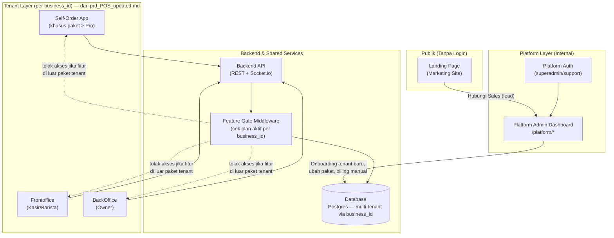
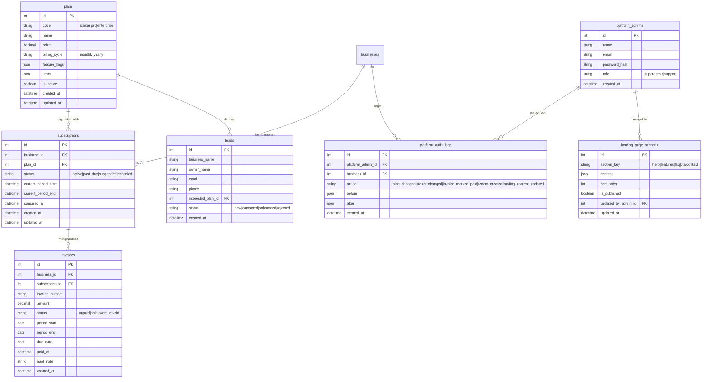

# PRD — Project Requirements Document
## Fase 3: Transformasi ke SaaS Multi-Tenant (Landing Page + Platform Admin + Paket Berlangganan)

> **Dokumen ini adalah lanjutan dari `prd_POS_updated.md` (Fase 0–2).** Seluruh domain operasional yang sudah dibangun — Self-Ordering, Frontoffice (Kasir/Barista), dan BackOffice (Owner) — **tidak dibangun ulang**. PRD ini menambahkan **layer platform** di atasnya: (1) **Landing Page** untuk akuisisi pelanggan baru, (2) **Platform Admin Dashboard (Internal)** untuk mengelola seluruh kafe (tenant) yang berlangganan, dan (3) **sistem paket berlangganan** (Starter, Pro, Enterprise) yang membatasi akses fitur per tenant. Skema 12 tabel inti pada PRD sebelumnya dipertahankan penuh dan menjadi domain "tenant" di bawah `business_id`.

---

## 1. Overview

Produk sebelumnya (`prd_POS_updated.md`) dibangun sebagai aplikasi single-tenant untuk satu coffee shop, namun sudah dirancang **SaaS-friendly** sejak awal (`business_id` sebagai boundary kepemilikan data di seluruh tabel operasional). Fase ini merealisasikan rencana tersebut menjadi produk **SaaS multi-tenant** bernama sementara **"Platform POS Kafe"**, di mana satu instance aplikasi dapat melayani banyak kafe (banyak `business`) sekaligus.

Tiga permukaan baru ditambahkan di atas domain operasional yang sudah ada:

1. **Landing Page (Marketing Site)** — halaman publik untuk memperkenalkan produk, menampilkan paket harga, dan mengonversi prospek menjadi pengguna baru (sign up / request demo).
2. **Platform Admin Dashboard (Internal)** — dashboard yang **hanya dapat diakses oleh tim internal (bukan owner kafe)** untuk mengelola seluruh tenant: onboarding kafe baru, mengatur paket berlangganan, memantau status pembayaran, dan melihat kesehatan penggunaan tiap tenant.
3. **Sistem Paket Berlangganan (Subscription & Feature Gating)** — setiap `business` terikat pada satu paket (**Starter**, **Pro**, atau **Enterprise**) yang menentukan modul apa saja yang dapat diakses oleh Frontoffice/BackOffice kafe tersebut.

Tujuan utama fase ini adalah mengubah produk dari "aplikasi POS satu kafe" menjadi "produk SaaS yang bisa dijual berulang ke banyak kafe", tanpa mengubah alur inti Self-Order, Frontoffice, dan BackOffice yang sudah terbukti berjalan (Fase 2).

## 2. Requirements

Persyaratan tingkat tinggi untuk pengembangan Fase 3:

- **Multi-Tenancy Nyata:** Field `business_id` yang sebelumnya sudah ada di skema (namun belum ditegakkan sepenuhnya di tiap request Fase 2) harus **ditegakkan sebagai isolasi data wajib** di seluruh query backend — satu tenant tidak boleh pernah melihat data tenant lain.
- **Tiga Paket Tetap:** MVP SaaS hanya mendukung **3 paket tetap**: **Starter**, **Pro**, **Enterprise** (bukan builder paket custom/self-service; Enterprise tetap dikonfigurasi manual oleh tim internal).
- **Feature Gating per Paket:** Akses ke modul (Self-Order, Manajemen Bahan, Analytics lanjutan, kustomisasi tema, dsb.) ditentukan oleh paket aktif tenant, bukan hardcode per bisnis.
- **Landing Page Publik:** Dapat diakses tanpa login, menampilkan value proposition, perbandingan paket, dan satu form **Hubungi Sales** yang berlaku untuk ketiga paket (Starter, Pro, Enterprise) — bukan sign-up instan untuk paket manapun.
- **Peran Baru — Platform Admin:** Peran ini terpisah total dari peran `owner|kasir|barista` milik tenant. Platform Admin **tidak otomatis dapat melihat data transaksi/menu operasional tenant** — hanya melihat data administratif (status langganan, penggunaan agregat, kontak, billing).
- **Onboarding Tenant Baru:** Proses membuat `business` baru beserta akun `owner` pertamanya dilakukan melalui Platform Admin Dashboard (bukan self-service signup penuh di MVP ini — lihat §9 batasan scope).
- **Billing Sederhana (MVP):** MVP tidak wajib terintegrasi payment gateway untuk *subscription* (berbeda dengan pembayaran transaksi pelanggan kafe yang sudah pakai Midtrans di Fase 2). Status pembayaran langganan dicatat **manual oleh Platform Admin** (invoice paid/unpaid), dengan struktur data yang siap diintegrasikan ke payment gateway di fase berikutnya.
- **Upgrade/Downgrade Paket:** Platform Admin dapat mengubah paket tenant kapan saja; perubahan langsung memengaruhi akses fitur tenant tersebut secara real-time/near real-time.
- **Tanpa Trial:** Tidak ada masa uji coba gratis dalam bentuk apa pun. Tenant baru langsung berlangganan paket yang dipilih (Starter/Pro/Enterprise) sejak hari pertama diaktifkan oleh Platform Admin/Sales.
- **Audit Minimal:** Setiap perubahan paket/status langganan tenant dicatat (siapa mengubah, kapan, dari paket apa ke paket apa).
- **Tidak Mengubah Domain Operasional:** Self-Order, Frontoffice, BackOffice existing (skema 12 tabel, alur order, realtime, printer, dsb.) tetap seperti Fase 2 — hanya dibungkus dengan pengecekan paket.

## 3. Paket Berlangganan (Subscription Plans)

| Aspek | **Starter** | **Pro** | **Enterprise** |
|---|---|---|---|
| Target | Kafe kecil, baru mulai, transaksi manual di kasir | Kafe/coffee shop dengan self-order & manajemen stok penuh | Kafe/jaringan dengan kebutuhan kustomisasi & skala lebih besar |
| Self-Ordering (QR pelanggan) | ❌ Tidak tersedia | ✅ Tersedia | ✅ Tersedia |
| Frontoffice (Kasir/Barista) — Input Manual & Pembayaran Cash/QRIS | ✅ | ✅ | ✅ |
| Cetak Struk (print preview / ESC-POS) | ✅ Dasar | ✅ | ✅ |
| Manajemen Meja & QR Code | ❌ (tidak relevan tanpa self-order) | ✅ | ✅ |
| Manajemen Bahan & Stok (Inventory) | ❌ Tidak tersedia | ✅ | ✅ |
| Offline Mode & Sync | ❌ | ✅ | ✅ |
| Dashboard Owner | ✅ **Sederhana** — total omset & jumlah order per hari/minggu/bulan saja | ✅ Lengkap — grafik, sales type, top item | ✅ Lengkap + widget custom |
| Laporan Penjualan | ✅ **Ringkasan sederhana** (angka & tabel dasar, tanpa breakdown lanjutan) | ✅ Lengkap (Omset, Sales Type self-order vs manual, Performa Item per menu/kategori/varian, export CSV) | ✅ Semua fitur Pro + laporan custom/export tambahan |
| Manajemen Staff (Kasir/Barista) | ✅ Terbatas (maks. sejumlah kuota, mis. 3 akun) | ✅ Tanpa batas wajar | ✅ Tanpa batas |
| Pengaturan Pajak & Service Charge | ✅ Dasar (on/off) | ✅ Lengkap (label pajak, bearer, dsb.) | ✅ Lengkap |
| Kustomisasi Tema Self-Order | ❌ | ✅ Preset tema | ✅ Preset + **kustom penuh** (warna, logo, font) |
| Custom Domain / Branding Landing Halaman Self-Order | ❌ | ❌ | ✅ |
| Multi-Cabang / Multi-Outlet | ❌ | ❌ (single outlet per business) | ✅ (roadmap — lihat §9) |
| Integrasi/API Khusus | ❌ | ❌ | ✅ (atas permintaan, dikerjakan tim internal) |
| Dukungan | Email/komunitas | Email prioritas | Dedicated support / SLA |
| Batas Jumlah Meja (jika self-order aktif) | – | Tidak terbatas | Tidak terbatas |

> **Prinsip desain paket:** Starter sengaja **tidak** mendapatkan Self-Order maupun Manajemen Bahan agar jelas menjadi entry point yang murah dan sederhana (sesuai instruksi: "starter hanya POS dan dashboard owner dengan laporan penjualan sederhana"). Pro adalah **paket lengkap** dari seluruh fitur yang sudah dibangun di `prd_POS_updated.md` Fase 2. Enterprise = Pro + kustomisasi/skala, dikerjakan case-by-case oleh tim internal, bukan self-service.

Detail nilai kuota (jumlah meja, jumlah staff, dsb.) bersifat **konfigurable** oleh Platform Admin per paket (disimpan di `plans.limits` JSON), bukan hardcode di kode aplikasi, agar tim bisa menyesuaikan harga/kuota tanpa deploy ulang.

## 4. Core Features

### 4.1 Landing Page (Marketing Site — Publik)

- **Hero Section:** Value proposition utama produk (mis. "Digitalisasi kasir & pemesanan kafe Anda dalam hitungan menit").
- **Perbandingan Paket:** Menampilkan tabel Starter/Pro/Enterprise (data diambil dari `plans` agar konsisten dengan yang dikonfigurasi Platform Admin, bukan konten statis terpisah).
- **CTA Pendaftaran:**
  - Starter, Pro, maupun Enterprise sama-sama memakai satu form **"Hubungi Sales"** (nama bisnis, nama calon pemilik, email, no. HP, paket yang diminati) → tersimpan sebagai *lead*, ditindaklanjuti tim sales secara manual.
  - Tidak ada jalur sign-up instan/self-service untuk paket apa pun — akun kafe baru hanya dibuat lewat Onboarding Tenant Baru di Platform Admin Dashboard setelah proses sales selesai (lihat §9).
- **Fitur & Manfaat:** Penjelasan modul (Self-Order QR, Real-time Order, Manajemen Stok, Analytics) dengan referensi ke kapabilitas nyata yang sudah dibangun.
- **FAQ & Kontak.**
- Halaman ini murni informatif/marketing — **tidak menyentuh data operasional tenant mana pun**.

### 4.2 Platform Admin Dashboard (Internal — Super Admin/Support)

Diakses melalui route terpisah (mis. `/platform/*`), dengan sistem login **terpisah** dari login staff kafe (`/login` milik tenant tetap seperti Fase 2).

- **Login Platform Admin**
  - Role: `superadmin` dan `support` (support = akses lebih terbatas, mis. tidak bisa ubah billing).
- **Daftar Tenant (Businesses)**
  - Tabel seluruh kafe terdaftar: nama bisnis, paket aktif, status langganan (`active|past_due|suspended|canceled`), tanggal bergabung, jumlah order 30 hari terakhir (agregat, bukan detail transaksi).
  - Filter & pencarian berdasarkan paket dan status.
- **Detail Tenant**
  - Informasi bisnis (nama, kontak, email owner).
  - Riwayat perubahan paket (audit log).
  - Ringkasan penggunaan: jumlah staff, jumlah meja (jika Pro/Enterprise), jumlah order per periode — **agregat/statistik saja**, bukan isi struk/nama pelanggan individual, untuk menjaga privasi data tenant.
  - Aksi: **Ubah Paket** (upgrade/downgrade), **Suspend/Aktifkan Tenant**, **Reset Password Owner** (bantuan darurat).
- **Onboarding Tenant Baru**
  - Form: nama bisnis, slug/subdomain, email & nama owner, paket berlangganan yang disepakati (Starter/Pro/Enterprise).
  - Sistem membuat record `business` + akun `users` (role `owner`) awal + `subscriptions` berstatus `active` — langsung aktif sejak dibuat, tanpa status trial.
- **Manajemen Paket (Plans)**
  - CRUD 3 paket tetap: nama, harga, siklus tagihan (bulanan/tahunan), daftar fitur (`feature flags`), kuota (`limits` — mis. maks. meja, maks. staff).
  - Perubahan di sini **langsung memengaruhi feature gating** semua tenant pada paket tersebut (kecuali override khusus per-tenant untuk kasus Enterprise custom).
- **Override Fitur per Tenant**
  - Di luar paket, Platform Admin dapat memberi/menutup akses fitur tertentu untuk **satu kafe spesifik** (mis. bonus akses Self-Order untuk satu kafe Starter tanpa mengubah paketnya, atau mencabut sementara satu fitur dari kafe tertentu).
  - Override ini disimpan per-key (bukan ganti seluruh paket) — key yang tidak diatur di override tetap mengikuti flag paket seperti biasa. Bisa dihapus kapan saja untuk kembali sepenuhnya ke default paket.
- **Billing & Invoice (Manual — MVP)**
  - Daftar invoice per tenant per periode (jumlah tagihan, status `unpaid|paid|overdue`, tanggal jatuh tempo).
  - Platform Admin dapat menandai invoice sebagai **Paid** secara manual (pembayaran ditransfer di luar sistem untuk MVP).
  - Riwayat invoice per tenant dapat diekspor (CSV), mengikuti pola export yang sudah ada di Analytics Fase 2.
- **Kelola Konten Landing Page (CMS Ringan)**
  - Platform Admin dapat mengubah konten Landing Page tanpa perlu deploy ulang: teks Hero, daftar Fitur & Manfaat, FAQ, dan info kontak/CTA.
  - Konten disimpan sebagai data per-section (`landing_page_sections`), masing-masing section berupa JSON bebas agar fleksibel mengikuti kebutuhan copywriting tanpa perlu migrasi skema tiap kali teks berubah.
  - Landing Page (publik) mengambil konten ini lewat `GET /public/landing-content` — perubahan yang disimpan admin langsung tampil begitu di-*publish*.
  - Perbandingan paket tetap bersumber dari tabel `plans` (bukan bagian dari CMS ini), supaya harga/fitur selalu konsisten dengan data yang sesungguhnya berlaku.
- **Platform Analytics (Ringan)**
  - Ringkasan jumlah tenant per paket, tenant baru per bulan, estimasi MRR (Monthly Recurring Revenue) sederhana dari `plans.price × jumlah tenant aktif per paket`.

### 4.3 Modul Operasional Tenant (Referensi — Tidak Dibangun Ulang)

Modul berikut **sudah dibangun di `prd_POS_updated.md`** dan pada Fase 3 hanya ditambahkan **pengecekan paket** sebelum route/fitur dapat diakses:

- **Self-Ordering (Pelanggan via QR)** — hanya aktif jika paket tenant ≥ Pro.
- **Frontoffice (Kasir/Barista)** — selalu tersedia di semua paket; sub-modul **Manajemen Bahan/Inventory** dan **Offline Mode** hanya aktif jika paket ≥ Pro.
- **BackOffice (Owner)** — Dashboard & Laporan Penjualan selalu tersedia, namun **kedalaman datanya berbeda per paket** (lihat §3): Starter hanya melihat ringkasan omset & jumlah order, sedangkan Pro/Enterprise melihat breakdown lengkap (Sales Type, Performa Item, grafik recharts, dsb.).
- **Manajemen Meja/QR, Tema Self-Order, Pengaturan Pajak lanjutan** — hanya aktif di paket ≥ Pro sesuai matriks §3.

Jika tenant di-downgrade dari Pro ke Starter, data historis (order, stok, dsb.) **tidak dihapus** — hanya UI/akses fitur yang dibatasi kembali sesuai paket baru (fail-safe: data lama tetap tersimpan agar tenant bisa upgrade kembali tanpa kehilangan riwayat).

## 5. User Flow

### 5.1 Prospek → Tenant Baru (via Landing Page + Platform Admin)

1. Prospek membuka Landing Page, melihat perbandingan paket.
2. Prospek mengisi form "Hubungi Sales" (berlaku sama untuk ketiga paket — Starter, Pro, Enterprise) → tercatat sebagai *lead*.
3. Tim internal (Sales/Platform Admin) meninjau lead, lalu melakukan **Onboarding Tenant Baru** dari Platform Admin Dashboard: membuat `business`, akun `owner`, dan memilih paket berlangganan — langsung aktif, tanpa periode trial.
4. Owner menerima kredensial awal (email) dan login ke `/login` seperti alur Fase 2 — langsung diarahkan ke `/backoffice/dashboard` sesuai paketnya.
5. Owner melengkapi profil bisnis, menambahkan menu/meja/staff (menu tersebut disembunyikan/ditampilkan sesuai paket).

### 5.2 Operasional Harian Tenant

Tidak berubah dari `prd_POS_updated.md` §4 (Pelanggan scan QR → Self-Order → Frontoffice terima order real-time → BackOffice pantau analytics), dengan catatan: jika paket Starter, langkah Self-Order dilewati — pesanan hanya dibuat manual dari Frontoffice.

### 5.3 Platform Admin Mengelola Tenant

1. Login ke `/platform/login` (terpisah dari login tenant).
2. Melihat daftar tenant beserta status langganan masing-masing.
3. Mengonfirmasi upgrade/downgrade paket sesuai permintaan tenant (setelah pembayaran manual diterima), atau menonaktifkan (`suspended`) tenant yang menunggak/tidak melanjutkan.
4. Mencatat invoice bulanan per tenant aktif dan menandainya `paid` saat pembayaran diterima.

## 6. Architecture

Komponen arsitektur:

- **Landing Page:** Static/SSR site terpisah dari aplikasi tenant, dapat di-deploy independen (mis. domain utama `namaproduk.com`), memanggil API publik terbatas (mis. `GET /public/plans`, `GET /public/landing-content`, `POST /public/leads`). Konten non-pricing (hero, fitur, FAQ) diambil dari `landing_page_sections`, bukan hardcode di kode frontend — supaya tim non-teknis bisa mengubah copy dari Platform Admin Dashboard.
- **Platform Admin Dashboard:** Aplikasi terpisah secara route/permission dari BackOffice tenant meskipun bisa satu codebase frontend (dipisah lewat guard role `platform_admin` vs `owner|kasir|barista`). **Tidak boleh** menggunakan session/token yang sama dengan sesi tenant.
- **Feature Gate Middleware:** Lapisan baru di Backend API yang mengecek `subscriptions.plan_id` → `plans.feature_flags` sebelum mengizinkan akses ke endpoint tertentu (mis. endpoint self-order, endpoint inventory). Ini adalah **penegakan otoritatif** (bukan hanya disembunyikan di UI) agar tenant Starter tidak bisa mengakses fitur Pro lewat API langsung.
- **Database:** Tetap satu database Postgres (skema Fase 2), ditambah tabel baru `plans`, `subscriptions`, `invoices`, `platform_admins`, `platform_audit_logs`, `leads`. Semua tabel operasional lama tetap memakai `business_id` sebagai tenant key (sesuai fondasi yang sudah disiapkan sejak Fase 0).

## 7. Database Schema (Tambahan di Atas Skema Fase 2)

> Skema 12 tabel inti (`businesses, users, tables, categories, products, product_options, orders, order_items, payments, order_status_logs, ingredients, stock_movements`) **dipertahankan seluruhnya** dari `prd_POS_updated.md` §6. Bagian ini hanya menambahkan tabel-tabel baru untuk layer platform/SaaS.

Perubahan pada tabel `businesses` yang sudah ada (Fase 2) — **tambahan kolom, bukan pengganti**:

| Kolom Baru | Tipe | Keterangan |
|---|---|---|
| `slug` | string | Identifier unik tenant, dipakai untuk URL/subdomain Self-Order |
| `current_plan_id` | int FK → `plans.id` | Denormalisasi paket aktif untuk lookup cepat di Feature Gate |
| `onboarded_at` | datetime | Kapan tenant pertama kali diaktifkan |
| `is_platform_suspended` | boolean | Kill-switch cepat oleh Platform Admin (independen dari status `subscriptions`) |
| `feature_overrides` | json, nullable | Pengecualian fitur KHUSUS tenant ini, di luar `plans.feature_flags` paketnya — mis. `{"selfOrder": true}` memberi akses Self-Order meski paketnya Starter. Key yang tidak disebutkan tetap fallback ke flag plan. Diatur lewat `PATCH /platform-admin/businesses/:id/feature-overrides` |

## 8. Design & Technical Constraints

1. **Isolasi Data Tenant (Wajib):** Setiap query operasional di backend **harus** menyertakan `WHERE business_id = :current_business_id` yang berasal dari sesi/token staff yang login — tidak boleh mengandalkan filter di frontend saja.
2. **Pemisahan Sesi Platform vs Tenant:** Token/JWT untuk `platform_admins` dan untuk `users` (staff tenant) harus memiliki `scope`/`audience` berbeda, sehingga token satu tidak dapat dipakai untuk mengakses endpoint lainnya.
3. **Feature Gating di Backend, Bukan Hanya UI:** Middleware `Gate` (lihat §6) wajib memvalidasi paket aktif tenant untuk **setiap** endpoint fitur berbayar (self-order, inventory, tema custom, dsb.), bukan sekadar menyembunyikan menu di frontend.
4. **Downgrade Aman:** Downgrade paket tidak boleh menghapus data historis (`orders`, `stock_movements`, dsb.); hanya menonaktifkan akses fitur terkait sampai upgrade kembali.
5. **Billing MVP = Manual, Struktur Siap Otomatisasi:** Tabel `invoices`/`subscriptions` dirancang agar kompatibel jika di fase berikutnya diintegrasikan dengan payment gateway langganan (mis. Midtrans Recurring/Stripe), tanpa migrasi skema besar.
6. **Landing Page Terpisah dari Aplikasi Tenant:** Landing Page tidak boleh memuat data tenant apa pun secara langsung (kecuali data publik seperti daftar paket); hindari coupling erat agar Landing Page dapat di-deploy/di-update independen dari rilis aplikasi tenant.
7. **Audit Trail Wajib untuk Aksi Sensitif Platform Admin:** Perubahan paket, suspend/aktivasi tenant, dan penandaan invoice `paid` wajib tercatat di `platform_audit_logs` (siapa, kapan, before/after).
8. **Konsistensi dengan Fase 2:** Realtime (Socket.io per-room `business:<id>`), autentikasi JWT, dan struktur pembayaran transaksi (Midtrans untuk pembayaran pelanggan kafe) pada `prd_POS_updated.md` **tidak berubah** — hanya ditambahkan pengecekan paket sebelum fitur terkait dapat dipakai.
9. **Konfigurasi Paket sebagai Data, Bukan Kode:** Batas kuota (jumlah meja, staff) dan daftar fitur per paket disimpan sebagai data (`plans.feature_flags`, `plans.limits`), agar tim bisa menyesuaikan penawaran tanpa deploy ulang aplikasi.
10. **Konten Landing Page sebagai Data:** Sama seperti paket, teks Hero/Fitur/FAQ Landing Page disimpan di `landing_page_sections`, bukan hardcode di frontend, sehingga tim non-teknis (mis. marketing) bisa mengubah copy lewat Platform Admin Dashboard tanpa melibatkan developer.
11. **Desain UI:** Landing Page dan Platform Admin Dashboard menggunakan bahasa visual profesional/modern yang konsisten dengan identitas produk, namun **berbeda secara jelas** dari tampilan Frontoffice/BackOffice/Self-Order tenant, agar staf internal tidak tertukar konteks saat berpindah antar dashboard.

## 9. MVP Scope & Batasan (Fase 3)

Termasuk dalam MVP SaaS Fase 3:

- Landing Page publik dengan pricing 3 paket & form lead.
- Platform Admin Dashboard: daftar tenant, onboarding manual, manajemen paket, billing manual (invoice tercatat, ditandai paid manual), audit log dasar.
- Feature gating backend berdasarkan paket aktif untuk seluruh modul yang sudah didaftar di §3.
- Kelola konten Landing Page (CMS ringan) lewat Platform Admin Dashboard — lihat §4.2 & §7.

**Di luar scope MVP Fase 3** (dapat dikembangkan di fase berikutnya):

- Self-service signup penuh tanpa peninjauan Platform Admin (mis. instan create tenant dari Landing Page tanpa approval).
- Payment gateway otomatis untuk tagihan langganan (recurring billing) — MVP tetap manual.
- Multi-cabang/multi-outlet dalam satu `business` (Enterprise saat ini masih 1 outlet per tenant, kustomisasi lain di luar itu dikerjakan manual oleh tim).
- Notifikasi otomatis (email/WA) untuk invoice jatuh tempo, dsb. — MVP cukup terlihat di dashboard Platform Admin.
- Dunning/auto-suspend otomatis saat invoice overdue — MVP masih manual oleh Platform Admin.
- Custom domain otomatis (self-service) untuk Enterprise — MVP dikonfigurasi manual oleh tim infra.

---

**Catatan penutup:** PRD ini secara sengaja **tidak mengubah** kontrak data maupun alur kerja yang sudah tervalidasi di `prd_POS_updated.md` (Fase 0–2). Tujuannya murni menambahkan lapisan bisnis (paket, tenant management, marketing) di atas fondasi `business_id` yang memang sejak awal sudah disiapkan untuk skenario ini.
